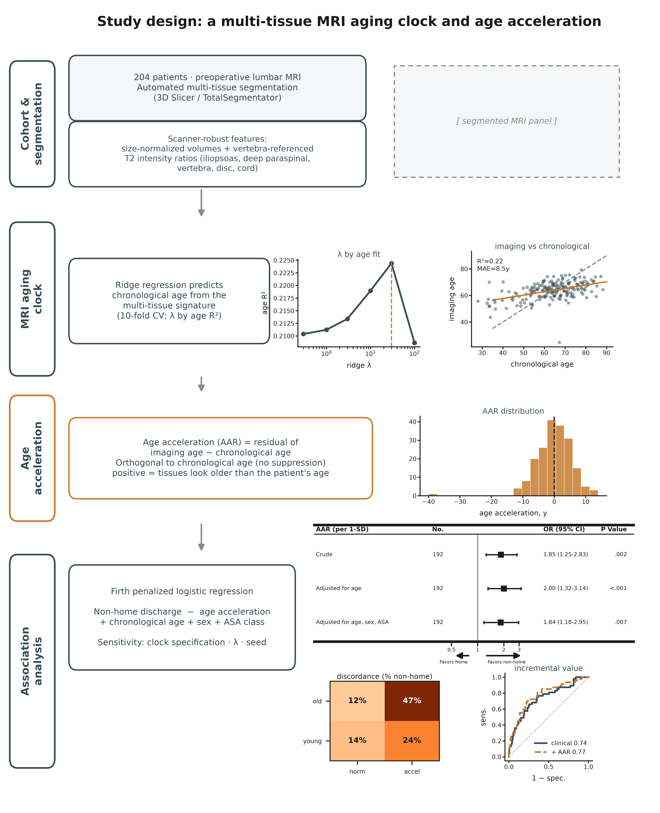

# lumbar-discharge-morphometry

Analysis code for the study *A Multi-Tissue MRI Aging Signature and Non-Home Discharge After
Lumbar Spine Surgery: A Hypothesis-Generating Study of Imaging Age Acceleration* (STROBE).



*Study design. Multi-tissue segmentation of preoperative axial T2 MRI (iliopsoas, deep
paraspinal, vertebra, disc, cord) feeds a cross-validated ridge aging clock; the age-acceleration
residual (orthogonal to chronological age) is related to non-home discharge by Firth penalized
logistic regression.*

## Summary

We tested whether preoperative lumbar MRI encodes a component of biological aging that predicts
non-home discharge beyond chronological age. On axial T2-weighted MRI, the iliopsoas, deep
paraspinal muscle, vertebral body, intervertebral disc, and spinal cord were segmented at L3–L5
(3D Slicer / TotalSegmentator v5.8.1). A ridge-regression clock was trained to predict
chronological age from scanner-robust multi-tissue features (size-normalized volumes and
vertebra-referenced T2 intensity ratios), using out-of-fold cross-validation with the penalty
selected by age-prediction accuracy rather than by the outcome. The age-acceleration residual
(imaging age minus chronological age, orthogonalized to chronological age) was the exposure and
was related to non-home discharge by Firth penalized logistic regression.

In 192 patients with complete multi-tissue imaging (47 non-home discharges), the clock predicted
chronological age with a cross-validated R² of 0.22 (mean absolute error 8.5 years). Age
acceleration was associated with non-home discharge independently of and additively to
chronological age (odds ratio per SD 1.84; 95% CI 1.18–2.95; P = .007). The association was
stronger for a clock built from intensity ratios alone (OR 2.12; 95% CI 1.40–3.32) and null for a
clock built from volumes alone (OR 1.01), indicating a tissue-quality rather than an atrophy
signature. Single-muscle, dichotomized-threshold, and age-uncorrected age-gap analyses were null
or produced suppression artifacts. The findings are hypothesis-generating: the study is
single-center with a modest event count, several exposure operationalizations were examined
without multiplicity adjustment, and the imaging features are not harmonized across scanners.

## Data availability

The repository contains code only. Individual patient data are not distributed. The pipeline
reads a frozen analytic CSV kept locally and listed in `.gitignore`; only aggregate result tables
are committed, and row-level clock predictions (`results/clock_predictions.csv`) are excluded. See
`DATA_AVAILABILITY.md`.

## Reproducing the analysis

```bash
python -m venv .venv && source .venv/bin/activate
pip install -r requirements.txt
cp config.example.yaml config.yaml            # set data_path to the local analytic CSV

python -m src.aging_clock          # writes results/clock_*.csv
python -m src.clock_figures        # writes figures/ (SVG, PNG, PDF) and tables/
pytest -q                          # tests run on synthetic frames; no real data required
```

The clock, the age-acceleration residual, and all association estimates use only NumPy, SciPy,
and pandas (Firth logistic regression is implemented in `src/firth.py`). A fixed master seed makes
two consecutive runs byte-identical.

## Repository layout

```
src/aging_clock.py    multi-tissue aging clock, age-acceleration residual, association models
src/firth.py          Firth penalized logistic regression (profile-likelihood CIs, PLR p-values)
src/clock_figures.py  manuscript figures (SVG/PNG/PDF) and tables
src/data_loading.py   cohort construction from the frozen analytic CSV
results/              aggregate result tables (row-level predictions excluded)
figures/ , tables/    generated outputs
docs/                 manuscript.md, STROBE_checklist.md, refs.bib, adr/
tests/                synthetic-data tests, including the age-orthogonality and Firth checks
```

`src/` also retains the earlier discharge-association modules used to generate the naive-approach
comparison (Figure S3); they are not part of the primary analysis.

## Citation and license

Cite as in `CITATION.cff`. Released under the MIT License (`LICENSE`).
